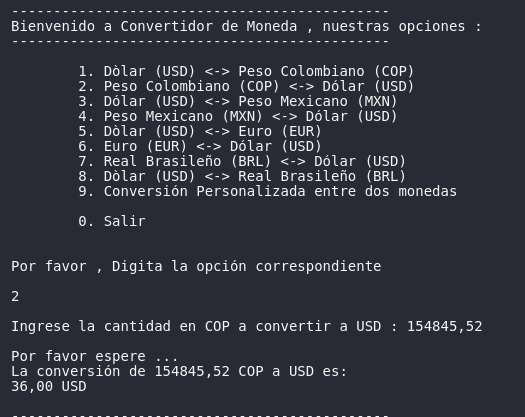
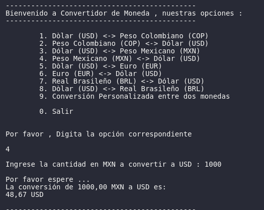
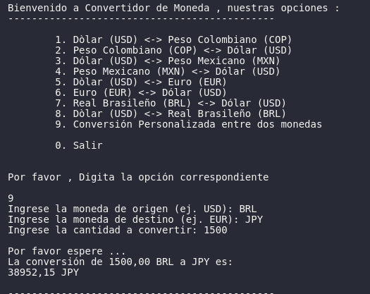

# ChallengeAlura-CurrencyConverter


ChallengeAlura-CurrencyConverter es una aplicación de conversión de monedas desarrollada como parte del desafío de Alura Latam. Esta aplicación proporciona una herramienta fácil de usar para convertir entre diferentes monedas utilizando tasas de cambio en tiempo real.

## 👨‍💻 Desarrollador

Adrian Daconte

- 🐱 GitHub: [@Adrian-Daconte](https://github.com/Adrian-Daconte)
- 💼 LinkedIn: [Adrian Daconte](https://www.linkedin.com/in/adrian-daconte/)

## 🌟 Características Principales

- 💱 Conversión entre múltiples monedas
- 🔄 Tasas de cambio en tiempo real
- 🖥️ Interfaz de línea de comandos fácil de usar
- 🌐 Utiliza API externa para obtener tasas de cambio actualizadas
- 🔒 Manejo seguro de claves API

## 📸 Capturas de pantalla

### 1. Conversión de USD a COP


*Ejemplo de conversión de Dólares estadounidenses (USD) a Pesos colombianos (COP)*

### 2. Conversión de COP a USD


*Ejemplo de conversión de Pesos colombianos (COP) a Dólares estadounidenses (USD)*

### 3. Conversión de MXN a USD


*Ejemplo de conversión de Pesos mexicanos (MXN) a Dólares estadounidenses (USD)*

### 4. Conversión personalizada


*Ejemplo de conversión personalizada utilizando códigos de moneda específicos*

## 🛡️ Manejo de Errores y Validaciones

- ✅ **Validación de entrada**: Se verifica que la cantidad a convertir sea un número válido y mayor que cero.
- 🔄 **Monedas distintas**: En la conversión personalizada, se asegura que las monedas de origen y destino no sean iguales.
- 💱 **Verificación de tasas**: Se comprueba la disponibilidad de las tasas de cambio para las monedas seleccionadas.
- 🔢 **Precisión en cálculos**: La aplicación utiliza valores de tipo `double` para mayor precisión en las conversiones.
- ⚠️ **Manejo de excepciones**: Se capturan y manejan adecuadamente las excepciones, proporcionando mensajes de error claros al usuario.

### Ejemplos de mensajes de error

- "Error: La cantidad debe ser mayor que cero."
- "Error: Las monedas de origen y destino no pueden ser iguales."
- "Error: No se pudo obtener la información de tasas de cambio."
- "Error: No se encontró la tasa de cambio para [moneda]"
- "Error inesperado: verifica las monedas a convertir"

## 🛠 Tecnologías Utilizadas

- Java 21
- Spring Boot 3.4.1
- Jackson para procesamiento JSON
- Maven

## 🏗 Estructura del Proyecto

```plaintext
src
└── main
    └── java
        └── com.dako.converter
            ├── ConverterApplication.java
            ├── api
            │   ├── ApiRequest.java
            │   ├── JsonConverter.java
            │   └── JsonConverteInterface.java
            ├── model
            │   └── CurrencyRecord.java
            └── services
                ├── AppMain.java
                └── GetDataFromApi.java

```

- 🚀 **ConverterApplication.java**: Punto de entrada principal de la aplicación Spring Boot.
- 🌐 **api**: Contiene clases para realizar solicitudes API y convertir JSON.
- 📦 **model**: Define el modelo de datos para las tasas de cambio.
- ⚙️ **services**: Incluye la lógica principal de la aplicación y el manejo de datos de la API.

## 🚀 Cómo Usar

1. Ejecute la aplicación.
2. Seleccione una opción del menú principal:
   - Conversiones predefinidas (por ejemplo, USD a COP, EUR a USD)
   - Conversión personalizada entre dos monedas
3. Ingrese la cantidad a convertir.
4. La aplicación mostrará el resultado de la conversión.

## 📥 Instalación y Configuración

1. **Descargar**: Obtenga el código fuente desde el repositorio de GitHub.

2. **Abrir**: Importe el proyecto en su IDE preferido.

3. **Requisitos**: Asegúrese de tener Java 21 instalado en su sistema.

4. **Configurar API**:
   - Localice el archivo `application.yml` en la carpeta de recursos.
   - Reemplace `SU_CLAVE_API_AQUI` con su clave API real.

5. **Compilar**: Utilice las herramientas de compilación de su IDE.

6. **Ejecutar**: Inicie la aplicación desde su IDE.

7. **Usar**: Siga las instrucciones en la consola para convertir monedas.

Nota: Obtenga una clave API válida de un proveedor de tasas de cambio antes de ejecutar.
